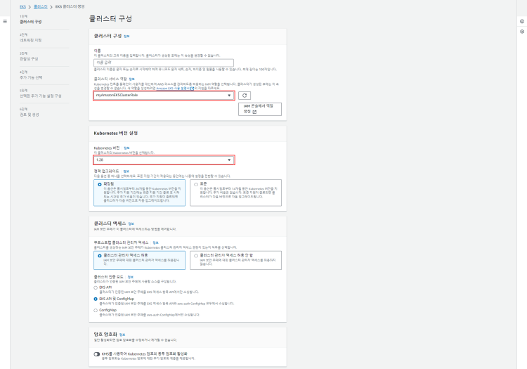
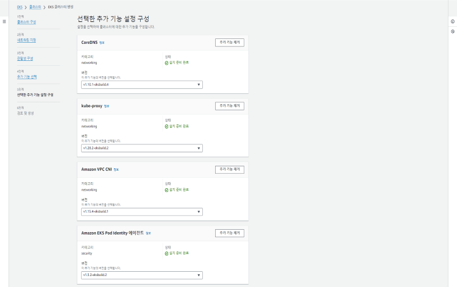
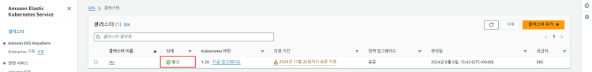
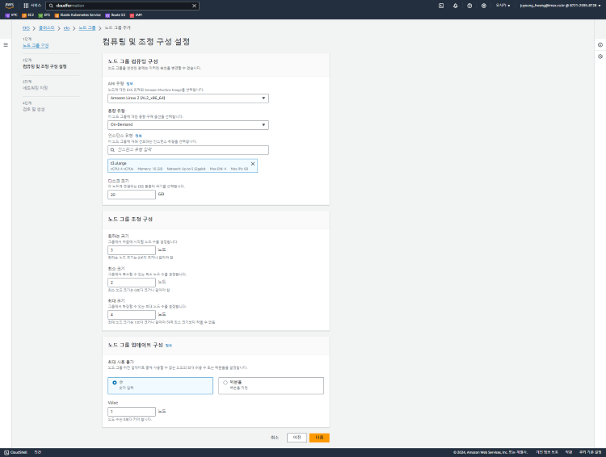
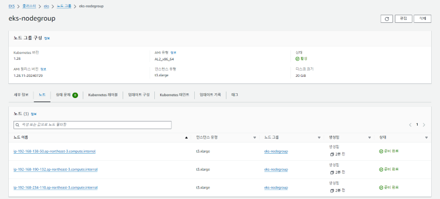
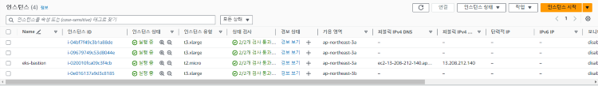

= EKS 환경에서 구축

본 장에서는 Amazon EKS 환경에서 폐쇄망으로 Kubespray를 이용해 HyperCloud를 설치하는 방법을 설명한다.

설치 과정은 다음과 같은 단계로 구성된다.

. <<EKSVPCBastion, VPC 및 Bastion 서버 생성>>
. <<EKSCluster, EKS 클러스터 생성 및 설정>>
. <<EKSNode, 노드 생성>>
. <<EFSSetting, EFS-CSI 드라이버 설치>>
. <<BastionSetting, Bastion 서버 설정>>
. <<ArgoCDInstallEks, ArgoCD 설치>>
. <<MasterClusterEks, 마스터 클러스터 설치>>
. <<ResourceDeployEks, 리소스 배포>>

1번부터 4번까지의 과정은 eksctl을 사용하거나, AWS Management Console을 사용하는 두 가지 방법으로 수행할 수 있다.

* eksctl 사용 방법:
+
'eksctl'은 명령줄 도구로, Bastion 서버에 사전 설치가 필요하다. 이 방법은 AWS Management Console에 비해 빠르고 간단하게 EKS 클러스터를 설정할 수 있는 장점이 있다. 특히, 자동화된 배포 및 설정을 간편하게 처리하고자 할 때 유리하다.

* AWS Management Console 사용 방법:
+
AWS Management Console은 GUI 기반의 설정 환경을 제공하여, 'eksctl'에 비해 보다 세부적인 설정 및 구성이 가능하다. GUI를 통해 사용자는 직접 옵션을 선택하고 구성할 수 있으므로, 세밀한 제어와 맞춤형 설정이 필요한 경우 적합하다.

각 방법의 장점과 단점이 있으므로, 환경에 따라 적절한 방법을 선택하는 것이 좋다. 자세한 내용은 link:https://docs.aws.amazon.com/ko_kr/eks/latest/userguide/getting-started.html[AWS 공식 사용자 가이드]를 참고하여 각 방법에 대한 최신 정보와 지침을 확인한다.

[#EKSVPCBastion]
== VPC 및 Bastion 서버 생성

본 절에서는 EKS 클러스터를 생성 및 사용을 위한 VPC와 Bastion 서버를 생성하는 방법을 다룬다.

.EKS를 생성하고 사용하려면 다음의 사전 준비가 필요하다.
[NOTE]
====
* IAM 계정 발급
* AWS Access Key ID
* AWS Secret Access Key
====

[#VPCCreating]
=== VPC 생성

VPC는 AWS Management Console을 통해 직접 생성하거나, AWS CloudFormation 템플릿을 사용해 자동으로 생성할 수 있다.

여기서는 AWS Management Console을 사용해 VPC를 생성하는 방법을 설명한다.

AWS Management Console에서 [VPC 서비스 > VPC > VPC 생성] 으로 이동한다.

'생성할 리소스'에서 'VPC 등'을 선택하고, '이름'을 입력한 후 환경에 맞게 다른 설정 값을 지정한다.

[#BastionCreating]
=== Bastion 서버 생성 및 설정

Bastion 서버는 외부에서 접근할 수 있는 서버로, AWS CLI, kubectl, eksctl 명령을 실행하기 위해 필요하다.

. *Bastion 서버 생성*
+
.. 키 페어 생성
+
[EC2 서비스 > 네트워크 및 보안 > 키 페어 > 키 페어 생성] 에서 Bastion 서버로 원격 접속하는 데 필요한 한 쌍의 키 페어를 생성한다.
+
private key는 로컬 PC에 다운로드되고, public key는 AWS에 저장된다.
+

+
.. 인스턴스 생성
+
[EC2 서비스 > 인스턴스 > 인스턴스 시작] 에서 이름을 입력하고, AMI와 인스턴스 유형을 선택한다.
+
키 페어 설정 단계에서 앞서 생성한 키 페어를 선택한다.
+
네트워크 설정을 편집하여 생성한 VPC를 선택하고, 서브넷은 Public Subnet을 선택하여 퍼블릭 IP 자동 할당을 활성화한다.
+
보안 그룹을 생성하고, SSH 포트(TCP/22)에 대한 인바운드 규칙을 추가한 후 인스턴스를 생성한다.
+

. *AWS CLI 설치*
+
pem 파일을 사용하여 Bastion 서버의 퍼블릭 IPv4 주소로 SSH 접속한다.
+
----
$ ssh -i <pem-file-name>.pem ec2-user@<bastion-public-ip>
----
+
AWS CLI 설치 파일을 다운로하고 설치한다.
+
----
$ curl "https://awscli.amazonaws.com/awscli-exe-linux-x86_64.zip" -o "awscliv2.zip"
$ unzip awscliv2.zip
$ sudo ./aws/install
----
+
설치 완료 후 설치를 확인한다.
+
----
$ aws --version
----
+
AWS 보안 인증을 입력한다.
+
----
$ aws configure
AWS Access Key ID [None]:   // 사전에 준비한 AWS Access Key ID를 입력
AWS Secret Access Key [None]:   // 사전에 준비한 AWS Secret Access Key를 입력
Default region name [None]:   // ex)ap-northeast-3
Default output format [None]: json
----
+
설정된 사용자 ID를 확인한다.
+
----
$ aws sts get-caller-identity
----

. *kubectl 설치*
+
EKS 클러스터의 ControlPlane과 마이너 버전이 동일하거나 하나 차이나는 kubectl 버전을 설치해야 한다. 예를 들어, 1.28 kubectl 클라이언트는 kubernetes 1.27, 1.28, 1.29 클러스터와 호환된다.
+
----
$ curl -O https://s3.us-west-2.amazonaws.com/amazon-eks/1.28.8/2024-04-19/bin/linux/amd64/kubectl
$ chmod +x ./kubectl
$ mkdir -p $HOME/bin && cp ./kubectl $HOME/bin/kubectl && export PATH=$HOME/bin:$PATH
$ echo 'export PATH=$HOME/bin:$PATH' >> ~/.bashrc

$ kubectl version --client
----

. *eksctl 설치*
+
----
# for ARM systems, set ARCH to: `arm64`, `armv6` or `armv7`
$ ARCH=amd64
$ PLATFORM=$(uname -s)_$ARCH

$ curl -sLO "https://github.com/eksctl-io/eksctl/releases/latest/download/eksctl_$PLATFORM.tar.gz"

# (Optional) Verify checksum
$ curl -sL "https://github.com/eksctl-io/eksctl/releases/latest/download/eksctl_checksums.txt" | grep $PLATFORM | sha256sum --check

$ tar -xzf eksctl_$PLATFORM.tar.gz -C /tmp && rm eksctl_$PLATFORM.tar.gz
$ sudo mv /tmp/eksctl /usr/local/bin

$ eksctl version
----

[#EKSCluster]
== EKS 클러스터 생성 및 설정

본 절에서는 EKS 클러스터를 생성하고 설정하는 방법을 설명한다.

. *클러스터 IAM 역할 생성 및 정책 연결*
+
Bastion 서버에서 cluster-trust-policy.json 파일에 다음 정책 내용을 복사한다.
+
----
{
  "Version": "2012-10-17",
  "Statement": [
    {
      "Effect": "Allow",
      "Principal": {
        "Service": "eks.amazonaws.com"
      },
      "Action": "sts:AssumeRole"
    }
  ]
}
----
+
역할을 생성한다.
+
----
# aws iam create-role \
  --role-name eksClusterRole \
  --assume-role-policy-document file://"cluster-trust-policy.json"
----
+
IAM 정책을 역할에 연결한다.
+
----
# aws iam attach-role-policy \
  --policy-arn arn:aws:iam::aws:policy/AmazonEKSClusterPolicy \
  --role-name eksClusterRole
----

. *클러스터 생성*
+
콘솔에서 [Elastic Kubernetes Service > 클러스터 > 클러스터 추가 > 생성]을 선택하여 클러스터를 생성한다.
+
'클러스터 서비스 역할'에 이전 단계에서 생성한 IAM 역할을 선택하고, Kubernetes 버전 1.28을 선택한다.
+

+
'VPC'에 기존에 생성한 VPC를 선택하고, 서브넷과 클러스터 엔드포인트 액세스를 설정한다.
+
image::../../images/eks_create_cluster_02.png[]
+
CloudWatch로 ControlPlane 감사 및 진단 로그를 전송할지 설정한다.
+

+
추가 기능을 선택한다. 클러스터 내 네트워킹을 위해 'CoreDNS', 'kube-proxy', 'Amazon VPC CNI'와 Kubernetes Service Account를 통해 Pod에 AWS IAM 권한을 부여하기 위해 'Amazon EKS Pod Identity 에이전트'를 선택한다.
+

+
필요에 따라 선택한 추가 기능에 대한 버전을 지정한다.
+

+
설정을 검토하고 클러스터를 생성한다.
+
생성한 클러스터의 상태가 '활성'이 될 때까지 기다린다.
+

. *클러스터 통신 구성*
+
kubeconfig 파일을 생성 또는 업데이트한다.
+
~/.kube 디렉터리에 새 config 파일이 생성되거나 기존 config 파일에 새 클러스터의 구성이 추가된다.
+
----
$ aws eks update-kubeconfig --region <region-code> --name <my-cluster>

// 예시
$ aws eks update-kubeconfig --region ap-northeast-3 --name eks
----
+
Bastion 서버에서 클러스터 구성을 확인한다.
+
----
$ kubectl get svc
----
+
결과는 다음과 같다.
+
----
NAME             TYPE        CLUSTER-IP   EXTERNAL-IP   PORT(S)   AGE
svc/kubernetes   ClusterIP   10.100.0.1   <none>        443/TCP   1m
----
+
오류 발생 시 클러스터 보안 그룹 규칙 등을 확인한다.

[#EKSNode]
== 노드 생성

본 매뉴얼에서는 EKS 클러스터에 관리형 노드 유형으로 진행하는 방법을 설명한다. Fargate 유형의 노드를 사용하는 경우, link:https://docs.aws.amazon.com/ko_kr/eks/latest/userguide/getting-started-console.html#eks-launch-workers[Amazon EKS 사용자 가이드]를 참고한다.

. *노드 IAM 역할 생성 및 정책 연결*
+
Bastion 서버에서 노드 IAM 역할을 생성하고 정책을 연결한다.
+
다음 내용을 node-role-trust-policy.json이라는 파일에 복사한다.
+
----
{
  "Version": "2012-10-17",
  "Statement": [
    {
      "Effect": "Allow",
      "Principal": {
        "Service": "ec2.amazonaws.com"
      },
      "Action": "sts:AssumeRole"
    }
  ]
}
EOF
----
+
노드 IAM 역할을 생성한다.
+
----
$ aws iam create-role \
  --role-name myAmazonEKSNodeRole \
  --assume-role-policy-document file://"node-role-trust-policy.json"
----
+
필요한 관리형 IAM 정책을 생성한 IAM 역할에 연결한다.
+
----
$ aws iam attach-role-policy \
  --policy-arn arn:aws:iam::aws:policy/AmazonEKSWorkerNodePolicy \
  --role-name myAmazonEKSNodeRole
$ aws iam attach-role-policy \
  --policy-arn arn:aws:iam::aws:policy/AmazonEC2ContainerRegistryReadOnly \
  --role-name myAmazonEKSNodeRole
$ aws iam attach-role-policy \
  --policy-arn arn:aws:iam::aws:policy/AmazonEKS_CNI_Policy \
  --role-name myAmazonEKSNodeRole
----

. *노드 그룹 추가*
+
노드 그룹은 EKS 클러스터에서 워커 노드를 실행하는 데 필요한 EC2 인스턴스 그룹이다.
+
콘솔에서 [Elastic Kubernetes Service > 클러스터 > 클러스터 선택 > 컴퓨팅 탭 > 노드 그룹 > 노드 그룹 추가]로 이동하여 노드 그룹을 추가한다.
+

+
'노드 IAM 역할'로 앞서 생성한 IAM 역할을 선택한다.
+

+
AMI 유형, 용량 유형(온디맨드 또는 스팟), 인스턴스 유형, 디스크 크기, 노드 수 등의 파라미터를 환경에 맞게 설정한다.
+

+
보안 요구사항에 따라 노드가 실행될 서브넷을 선택한다. 원격 액세스 허용 여부를 설정하고, SSH를 위한 키 페어를 선택한 후, 허용 대상을 지정한다.
+

+
설정한 값을 검토하고, 노드 그룹을 생성한다.

. *노드 생성 확인*
+
생성된 노드는 [노드 그룹 > 노드 탭]에서 확인하거나, EC2 인스턴스 대시보드에서 확인할 수 있다.
+

+

+
노드 그룹 상태가 '활성' 상태이고, 각 노드가 '준비 완료' 상태가 되면 Bastion 서버에 접속하여 확인한다.
+
Bastion 서버에서 다음 kubectl 명령어들을 실행하여 노드와 시스템 파드, 서비스 상태를 확인한다.
+
----
$ kubectl get nodes
$ kubectl get pods -A
$ kubectl get svc -A
----
+
위 명령어들을 통해 모든 워커 노드가 올바르게 등록되었는지, 시스템 파드와 서비스가 정상적으로 작동하는지 확인할 수 있다.
+
만약 노드가 정상적으로 생성되지 않거나 상태가 '준비 완료'가 되지 않는 경우, 클러스터의 보안 그룹 규칙을 확인한다. 필요한 포트와 프로토콜이 적절히 허용되었는지 검토하고, VPC 및 서브넷 설정을 재확인한다.

[#EFSSetting]
== EFS-CSI 드라이버 설치

[#BastionSetting]
== Bastion 서버 설정

본 절에서는 kubespray 수행을 위한 bastion 서버 환경 설정하는 방법에 대해서 설명한다.

환경 설정하는 순서는 다음과 같다.

. <<PackageSetting, 패키지 설정>>
. <<WebServerSetting, 웹 서버 레포지터리 설정>>
. <<ImageRegistrySetting, 로컬 이미지 레지스트리 설정>>

[#PackageSetting]
=== 패키지 설정
bastion 노드에 git, httpd, kubectl, pip3, ansible, rsync 패키지를 설치한다. +
bastion 노드 root, ec2-user 계정에 kubectl 및 .kube/config 파일을 옮긴다.

[#WebServerSetting]
=== 웹 서버 리포지터리 구성
웹 서버 리포지터리 구성은 1개의 bastion 에서만 진행한다.

. *files-repo 다운로드*
+
HyperCloud 설치에 필요한 패키지들을 다운로드한다.
+
아래의 FTP 서버에서 files-repo-k8s-v1.25를 다운로드한 뒤 파일명을 files-repo로 변경한다.
+
----
192.168.1.150:/backups/ck-ftp/k8s/install/offline/files-repo-k8s-v1.25

mv files-repo-k8s-v1.25 files-repo
----

. *로컬 리포지터리 구성*
+
외부 통신이 되지 않는 폐쇄망 환경을 운영하기 위한 RPM 패키지 저장소를 구성한다.
+
.로컬 리포지터리 구축
----
$ pushd {FILES_REPO_PATH}
$ createrepo_c ./
$ modifyrepo_c modules.yaml ./repodata
$ export LOCAL_REPO_PATH={FILES_REPO_PATH}
$ popd

$ dnf config-manager --add-repo file://$LOCAL_REPO_PATH
----
+
로컬 리포지터리 구축 명령어의 인자 값에 대한 설명은 다음과 같다.
+
[width="100%",options="header", cols="1,3"]
|====================
|인자 값|설명
|{FILES_REPO_PATH}|files-repo의 경로 입력
|====================
+
만약 `*createrepo_c*` 명령어를 사용할 수 없는 경우에는 `*createrepo*` 명령어를 사용하고, `*dnf*` 명령어를 사용할 수 없는 경우에는 /etc/yum.repos.d/ 하위에 아래와 같이 files-repo.repo 파일을 생성한다. *해당 .repo의 파일명은 반드시 files-repo로 지정하도록 한다.*
+
.files-repo.repo 파일
----
[files-repo]
name=files-repo
baseurl=file://$LOCAL_REPO_PATH
enabled=1
gpgcheck=0
----
+
. *httpd 설치 및 환경 설정*
+
httpd를 설치한 후 /etc/httpd/conf/ 하위의 httpd.conf 파일을 열어 아래와 같이 내용을 수정한다. +
files-repo 경로를 입력한 DocumentRoot 이외의 DocumentRoot는 주석 처리한다.
+
.httpd 설치
----
$ yum install httpd -y
----
+
.httpd.conf 파일
----
ServerName {WEB_SERVER_REPO_IP}

<Directory />
   AllowOverride All
   Require all granted
   Order deny,allow
</Directory>

DocumentRoot "{FILES_REPO_PATH}"

<Directory "{FILES_REPO_PATH}">
   AllowOverride None
   Require all granted
</Directory>
----
+
httpd.conf 파일의 인자 값에 대한 설명은 다음과 같다.
+
[width="100%",options="header", cols="1,3"]
|====================
|인자 값|설명
|{WEB_SERVER_REPO_IP}|웹 서버 리포지터리를 구성한 서버의 IP 주소 (예: 10.0.0.1)
|{FILES_REPO_PATH}|files-repo의 경로 입력 (예: /home/tmax/files-repo)
|====================

. *파일 리포지터리 권한 설정*
+
파일 리포지터리에 대한 접근 권한을 설정한다.
+
----
$ chcon -R -t httpd_user_content_t {FILES_REPO_PATH}
$ chmod 711 {FILES_REPO_PATH}
$ chmod 777 {FILES_REPO_PATH}/repodata/repomd.xml
$ systemctl restart httpd

이후 curl {server ip}/repodata/repomd.xml를 통해 repomd.xml 호출이 되는지 확인한다.
----
+
파일 리포지터리 권한 설정 명령어의 인자 값에 대한 설명은 다음과 같다.
+
[width="100%",options="header", cols="1,3"]
|====================
|인자 값|설명
|{FILES_REPO_PATH}|files-repo의 경로 입력 (예: /home/tmax/files-repo)
|====================

[#ImageRegistrySetting]
=== 이미지 레지스트리 구성
이미지 레지스트리 구성은 bastion 에서만 진행한다.

. *Docker 설치 및 환경 설정*
+
Docker 설치한 후 /etc/docker/ 하위의 daemon.json 파일을 열어 아래와 같이 insecure registry로 등록한다.
+
.Docker 설치
----
$ yum install docker
----
+
.daemon.json 파일
----
{
    "insecure-registries": ["{IMAGE_REGISTRY_IP:PORT}"]
}
----
+
daemon.json 파일의 인자 값에 대한 설명은 다음과 같다.
+
[width="100%",options="header", cols="1,3"]
|====================
|인자 값|설명
|{IMAGE_REGISTRY_IP:PORT}|이미지 레지스트리를 구성할 서버의 IP 주소와 Registry 이미지의 포트 번호 (예: 10.0.10.50:5000)
|====================

. *hypercloud5.3 이미지 다운로드*
+
아래의 FTP 서버에서 hypercloud5.3-images.tar를 다운로드한다.
+
[NOTE]
====
*hypercloud5.3-images.tar* 파일은 HyperCloud 설치에 필요한 이미지 파일이다. +
*registry.tar* 파일은 이미지 레지스트리를 구성하기 위한 Registry 이미지 파일이다.
====
+
----
192.168.1.150:/backups/ck-ftp/k8s/install/offline/hypercloud5.3-images
----

. *컨테이너 실행*
+
다운로드한 hypercloud5.3-images.tar 파일을 압축 해제한 후 해당 이미지를 이용해서 컨테이너를 실행한다.
+
.hypercloud5.3-images.tar 파일 압축 해제
----
$ tar -xvf hypercloud5.3-images.tar
----
+
.컨테이너 실행
----
$ docker run -it -d -p {IMAGE_REGISTRY_IP:PORT}:5000 --privileged -v {IMAGE_FILE_PATH}:/var/lib/registry registry
----
+
컨테이너 실행 명령어의 인자 값에 대한 설명은 다음과 같다.
+
[width="100%",options="header", cols="1,3"]
|====================
|인자 값|설명
|{IMAGE_REGISTRY_IP:PORT}|이미지 레지스트리를 구성한 서버의 IP 주소와 Registry 이미지의 포트 번호 (예: 10.0.10.50:5000)
|{IMAGE_FILE_PATH}|hypercloud5.3-images.tar 파일의 압축을 해제한 경로 입력 (예: /root/hypercloud5.2-registry)
|====================

. *이미지 레지스트리 확인*
+
----
$ docker ps -a
$ curl {IMAGE_REGISTRY_IP}:5000/v2/_catalog
----
+
이미지 레지스트리 확인 명령어의 인자 값에 대한 설명은 다음과 같다.
+
[width="100%",options="header", cols="1,3"]
|====================
|인자 값|설명
|{IMAGE_REGISTRY_IP}|이미지 레지스트리를 구성한 서버의 IP 주소 (예: 10.0.10.50)
|====================

+
. *워커 노드 cri에 local private registry insecure 설정*
+
eks 1.28 기준 containerd 사용하고 있어서 각 워커 노드마다 /etc/containerd/config.toml 에 local private registry insecure 설정을 한다.
+
----
/etc/containerd/config.toml

[plugins."io.containerd.grpc.v1.cri".registry]
  config_path = ""
  [plugins."io.containerd.grpc.v1.cri".registry.auths]
  [plugins."io.containerd.grpc.v1.cri".registry.configs]
    [plugins."io.containerd.grpc.v1.cri".registry.configs."{IMAGE_REGISTRY_IP}".tls]
      insecure_skip_verify = true
    [plugins."io.containerd.grpc.v1.cri".registry.configs."{IMAGE_REGISTRY_IP}".auth]

  [plugins."io.containerd.grpc.v1.cri".registry.headers]
  [plugins."io.containerd.grpc.v1.cri".registry.mirrors]
    [plugins."io.containerd.grpc.v1.cri".registry.mirrors."{IMAGE_REGISTRY_IP}"]
      endpoint = ["http://{IMAGE_REGISTRY_IP}"]
----

. *워커 노드 리소스 생성 권한 추가*
+
cluster-admin ClusterRole에 각 워커 노드를 사용자로 지정하여 워커 노드에 리소스 생성 권한을 추가한다.
+
----
kind: ClusterRoleBinding
apiVersion: rbac.authorization.k8s.io/v1
metadata:
  name: cluster-admin-test
roleRef:
  kind: ClusterRole
  apiGroup: rbac.authorization.k8s.io
  name: cluster-admin
subjects:
- apiGroup: rbac.authorization.k8s.io
  kind: User
  name: system:node:{WORKER1_NODE_IP}
- apiGroup: rbac.authorization.k8s.io
  kind: User
  name: system:node:{WORKER2_NODE_IP}
- apiGroup: rbac.authorization.k8s.io
  kind: User
  name: system:node:{WORKER3_NODE_IP}
----
+
ClusterRoleBinding의 인자 값에 대한 설명은 다음과 같다.
+
[width="100%",options="header", cols="1,3"]
|====================
|인자 값|설명
|{WORKER_NODE_IP}|eks로 생성한 클러스터의 노드들의 주소 (예: ip-x-x-x-x.ap-northeast-x.compute.internal)
|====================

[#ArgoCDInstallEks]
== ArgoCD 설치

본 절에서는 EKS 클러스터에 연결한 bastion에서 Kubespray를 이용하여 ArgoCD를 설치하는 방법에 대해서 설명한다.

ArgoCD를 설치하는 순서는 다음과 같다.

. <<KubesprayDecompressionArgoEks, Kubespray 파일 압축 해제>>
. <<KubesprayConfigArgoEks, Kubespray 환경 설정>>
. <<KubesprayRunArgoEks, Kubespray 실행>>

[#KubesprayDecompressionArgoEks]
=== Kubespray 파일 압축 해제

ArgoCD 설치를 위해 테크넷을 통해서 다운로드한 *kubespray-5.3.zip* 파일을 생성한 bastion 서버에 압축을 해제한다.

[#KubesprayConfigArgoEks]
=== Kubespray 환경 설정

Kubespray를 실행하기 위한 필수 설정 파일들을 정의한다.

NOTE: Kubespray를 실행하기 위해서는 사전 준비가 필요하다. 반드시  xref:offline-intro.adoc[설치 전 준비사항]을 참고하여 환경을 구성한다. bastion을 proxy하여 master node나 worker node에 접근한다. bastion에도 다른 노드에 접근하기 위해서 pem 파일이 필요하다.

CAUTION: RHEL 운영체제일 경우 `kubespray-5.3/cluster.yml` 파일을 열어 *- { role: bootstrap-os, tags: bootstrap-os}* 행을 반드시 주석 처리해야 한다.

. *노드 정보 등록*
+ 
`kubespray-5.3/inventory/tmaxcloud/inventory.ini` 파일을 열어 kubespray에서 설치할 노드들의 정보를 등록한다. +
eks는 사용자가 control-plane 노드에 접근을 하지 못해 [kube_control_plane]을 bastion 노드로 설정한다.
+
.예시
----
[all]
bastion ansible_host=x.x.x.x
worker1 ansible_host=y.y.y.y
worker2 ansible_host=z.z.z.z
worker3 ansible_host=w.w.w.w

# ## configure a bastion host if your nodes are not directly reachable
[bastion]
bastion

[kube_control_plane]
bastion

[etcd]

[kube_node]
worker1
worker2
worker3

[calico_rr]
[k8s_cluster:children]
kube_node
----

. *쿠버네티스 기본 정보 설정*
+
`kubespray-5.3/inventory/tmaxcloud/group_vars/all/all.yml` 파일을 열어 Kubernetes의 기본 정보를 설정한다. +
이때 loadbalancer_apiserver의 address 명은 주석처리 한다.
+
.예시
----
apiserver_loadbalancer_domain_name: "kubernetes-nlb-test-xxx.elb.us-east-x.amazonaws.com" <1>
loadbalancer_apiserver:
# address:
  port: 6443 <2>
  
upstream_dns_servers: <3>
  - /etc/resolv.conf
----
+
<1> AWS ELB(Elastic Load Balancing) 주소
<2> 쿠버네티스 API 서버 포트 번호
<3> AWS 도메인 네임서버 주소

. *폐쇄망 정보 설정*
+
`kubespray-5.3/inventory/tmaxcloud/group_vars/all/offline.yml` 파일을 열어 폐쇄망 관련 정보를 설정한다.
+
.예시
----
is_this_offline: true <1>
registry_host: "10.0.10.50:5000" <2>
files_repo: "http://172.22.5.2" <3>
----
+
<1> 폐쇄망 환경 여부 (폐쇄망일 경우 true)
<2> 프라이빗 레지스트리 주소
<3> 파일 리포지터리 주소

. *domain 설정*
+
`kubespray-5.3/inventory/tmaxcloud/group_vars/k8s_cluster/k8s-cluster.yml` 파일을 열어 사용할 도메인을 입력한다.
+
.예시
----
# Enable extra custom DNS domain - by sophal_hong@tmax.co.kr
enable_local_nip_domain: false <1>
enable_custom_domain: true
custom_domain_name: "domain.name" <2>
custom_domain_ip:
api_server_dns_cfwhn: true
----
+
<1> nip.io 도메인 사용 여부
<2> 도메인 명

. *설치할 애플리케이션 구성 정보 확인*
+
해당 애플리케이션의 구성 정보는 기본적으로 `kubespray-5.3/inventory/tmaxcloud/group_vars/k8s_cluster/addon.yml` 파일에서 설정이 가능하며, 추가적으로 커스터마이징이 필요할 경우에는 `kubespray-5.3/roles/bootstrap-cloud/task/` 및 `kubespray-5.3/roles/bootstrap-cloud/templates/` 하위 파일에서 설정이 가능하다.
+

. *설치 모듈 설정*
+
Kubespray로 설치될 애플리케이션(`nginx`, `hyperregistry`, `gitea`, `argocd`)의 구성 정보를 확인 및 설정한다. +
`kubespray-5.3/role/bootstrap-cloud/default/main.yml` 파일을 열어 argocd 설치를 위한 모듈 관련 정보를 설정한다. 해당 파일에서 storageclass, subdomain을 설정할 수 있다.
+
[CAUTION]
.eks용 모듈별 pvc storageclass 설정
====
1. hyperregistry_storage_class : efs-sc  +
2. hyperregistry_database_storage_class : efs-sc-999 +
3. gitea_storage_class : efs-sc-1000 +
4. gitea_mariadb_storage_class : efs-sc-1001 +
====

[#KubesprayRunArgoEks]
=== Kubespray 실행

ansible-playbook 명령을 사용하여 애플리케이션을 설치한다.

.사용 방법
----
$ ansible-playbook -i ./inventory/tmaxcloud/inventory.ini ./cluster.yml -t bootstrap-cloud -e ansible_user=ec2-user -e ansible_ssh_private_key_file={PEM_PATH} -e cloud_provider=aws -b --become-user=root
----
Kubespray 실행 명령의 인자 값에 대한 설명은 다음과 같다.

[width="100%",options="header", cols="1,3"]
|====================
|인자 값|설명
|{PEM_PATH}|다운로드한 PEM 파일의 경로 (예: /root/default.pem)
|====================

애플리케이션 설치가 정상적으로 완료되면, Gitea과 ArgoCD 간의 저장소가 자동으로 연동된다.

[#MasterClusterEks]
== 마스터 클러스터 설치

. *글로벌 변수 설정*
+
`kubespray-5.3/roles/bootstrap-cloud/templates/argocd_installer/application/app_of_apps/master-applications.yaml` 파일을 열어 마스터 클러스터의 글로벌 변수를 설정한다.
+
.예시
----
source:
      ...
      parameters:
        - name: global.domain
          value: "글로벌 도메인을 입력하세요 ex) testdomain.com" <1>
        - name: global.masterSingle.hyperAuthDomain
          value: "hyperauth full 도메인을 입력하세요 ex) hyperauth.testdomain.com" <2>
        # Avaliable values: UTC, Asia/Seoul
        - name: global.timeZone
          value: "UTC" <3>
        - name: global.network.disabled
          value: "true" <4>
        - name: global.privateRegistry
          value: "폐쇄망일 경우 image registry 주소를 입력하세요 ex) https://hyperregistry.testdomain.com" <5>
        - name: spec.source.repoURL
          value: "git repository URL을 입력하세요 ex) https://github.com/tmax-cloud/argocd-installer.git" <6>
        - name: spec.source.targetRevision
          value: "target Revision을 입력하세요 ex) main" <7>
    path: application/helm
    # 환경에 맞게 url 주소 변경 필요
    repoURL: https://github.com/tmax-cloud/argocd-installer <8>
    # 환경에 맞게 target branch/release 변경 필요
    targetRevision: HEAD <9>
----
<1> 애플리케이션 설치 시 인그레스 주소에 사용될 커스텀 도메인 이름
<2> 마스터 클러스터와 싱글 클러스터에서 사용할 HyperAuth 주소
<3> 애플리케이션 타임존 설정 
* UTC
* Asia/Seoul
<4> 폐쇄망 환경 여부 (폐쇄망일 경우 true)
<5> 프라이빗 컨테이너 이미지 레지스트리의 주소
<6> 최상위 변수용 ArgoCD와 연동된 Gitea 저장소 주소 (Gitea의 경우 URL 마지막에 .git을 추가)
<7> 최상위 변수용 Gitea에 연동되어 있는 argocd-installer의 브랜치 이름
<8> master-applications.yaml용 ArgoCD와 연동된 Gitea 저장소 주소 (Gitea의 경우 URL 마지막에 .git을 추가)
<9> master-applications.yaml용 Gitea에 연동되어 있는 argocd-installer의 브랜치 이름

. *애플리케이션 변수 설정*
+
`kubespray-5.3/roles/bootstrap-cloud/templates/argocd_installer/application/helm/master-values.yaml` 파일을 열어 마스터 클러스터의 애플리케이션 변수를 설정한다.
해당 파일에서 설치하고자 하는 모듈의 pvc storageclass를 eks에 맞게 변경한다.

[CAUTION]
.eks용 모듈별 pvc storageclass 설정
====
1. hyperregistry_storage_class : efs-sc  +
2. hyperregistry_database_storage_class : efs-sc-999 +
3. gitea_storage_class : efs-sc-1000 +
4. gitea_mariadb_storage_class : efs-sc-1001 +
5. hyperauth, hypercloud5-system : efs-sc-0 +
6. loki, grafana, prometheus, nexus : efs-sc
====
. *Gitea 동기화 작업*
+
ArgoCD와 연동된 Gitea의 argocd-installer 브랜치에서 `master-values.yaml`, `master-applications.yaml` 파일을 열어 위의 1~3번 과정과 동일하게 환경 변수를 설정한다.

. *애플리케이션 등록*
+
설치 환경에 애플리케이션을 등록한다.
+
----
$ kubectl -n argocd apply -f application/app_of_apps/master-applications.yaml
----

[#ResourceDeployEks]
== 리소스 배포

애플리케이션 동기화 작업을 통해 리소스를 배포한다.

이때 마스터 클러스터와 싱글 클러스터에서 각각 동기화 작업을 진행해야 하며, 각 애플리케이션의 동기화 순서는 아래를 참고한다.

[CAUTION]
.마스터 클러스터 동기화 순서
====
마스터 클러스터에서 애플리케이션 동기화 순서는 다음과 같다. 반드시 순서에 맞게 동기화 작업을 수행한다. +
1. strimzi-kafka-operator + hyperauth  +
2. hypercloud, console +
3. gitea, argocd, hyperregistry +
4. prometheus +
5. loki +
6. grafana +
7. service-mesh(istio, jaeger, kiali) +
8. catalog-controller +
9. cicd-operator(tekton) +
10. sonarqube, nexus +
11. image-validating-webhook
====

. *ArgoCD 콘솔 접속*
+
웹 브라우저의 주소 표시줄에 ArgoCD 서버의 주소를 입력한다.
+
[NOTE]
====
ArgoCD 서버 주소는 다음의 명령을 실행하여 확인할 수 있다.
----
$ kubectl get ingress -n argocd
----
====

. *ArgoCD 콘솔 로그인*
+
ArgoCD 콘솔 로그인 화면이 열리면 계정 아이디와 비밀번호를 입력한 후 *[SIGN IN]* 버튼을 클릭한다.
+
[NOTE]
====
ArgoCD 계정 아이디 및 초기 비밀번호 정보는 admin/admin 이며, 다음의 명령을 실행하여 확인할 수 있다.
----
$ kubectl -n argocd get secret argocd-initial-admin-secret -o jsonpath="{.data.password}" | base64 -d; echo
----
ArgoCD 콘솔에 첫 로그인 시 위에서 확인한 계정 정보로 로그인이 가능하며, 로그인 후 *[User Info]* 메뉴를 통해 비밀번호를 변경할 수 있다.
====

. *동기화할 애플리케이션 검색*
+
ArgoCD 콘솔의 **Applications 화면**에서 동기화 작업을 수행할 애플리케이션을 검색한 후 *[SYNC]* 버튼을 클릭한다.
+
image::../../images/figure_application_sync_01.png[]

. *동기화 옵션 설정*
+
동기화할 리소스 및 동기화 옵션을 설정한 후 *[SYNCHRONIZE]* 버튼을 클릭한다.
+
image::../../images/figure_application_sync_02.png[]

. *상태 확인*
+
애플리케이션의 *Status* 항목에 "Healthy"와 "Synced"가 표시되는지 확인한다.
+
image::../../images/figure_application_sync_03.png[]
